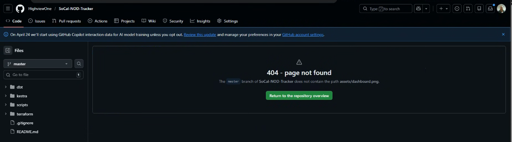

# SoCal NOD Tracker

> An end-to-end data pipeline tracking **Notice of Default (NOD)** filings across Southern California — a leading indicator of foreclosure activity.

## Problem Description

A **Notice of Default** is the first formal step in the foreclosure process. When a homeowner falls behind on their mortgage, the lender files an NOD with the county recorder's office — publicly documenting the delinquency and starting the clock on a potential foreclosure sale.

This project ingests daily NOD filings from **6 Southern California counties** (Los Angeles, Orange, Riverside, San Bernardino, San Diego, and Ventura), loads them into a cloud data warehouse, transforms the raw data into analytics-ready tables using dbt, and visualizes foreclosure trends in a Looker Studio dashboard.

**Business questions answered:**
- Which cities are seeing the highest foreclosure activity?
- How is NOD volume trending week-over-week across SoCal counties?
- Which lenders are filing the most NODs?
- What is the average loan-to-value (LTV) ratio for properties entering default?

## Dashboard



**Tile 1 — NODs per Week by County** (temporal): Stacked/grouped bar chart showing weekly NOD volume broken out by county, revealing regional foreclosure trends over time.

**Tile 2 — Top Cities by NOD Count** (categorical): Bar chart ranking cities by total NOD filings, highlighting the areas with the most distressed properties.

## Architecture

```
Daily CSV files (retran/)
        │
        ▼
  Kestra DAG (scheduled: 9am Mon–Fri)
        │
        ├──► GCS Bucket  ──────────────── Data Lake
        │    gs://aiagentsintensive-nod-lake/nods/
        │
        ├──► BigQuery Raw  ─────────────── nod_raw.nods
        │    partitioned by ingestion date
        │    clustered by county
        │
        └──► dbt transformations
                 │
                 ▼
             BigQuery Marts  ─────────── nod_production
                 ├─ stg_nods                  (view)
                 ├─ mart_nods_by_county_week   (table)
                 ├─ mart_nods_by_city          (table)
                 └─ mart_nods_by_lender        (table)
                          │
                          ▼
                   Looker Studio Dashboard
```

## Technologies

| Layer | Tool | Purpose |
|-------|------|---------|
| Cloud | Google Cloud Platform (GCP) | All infrastructure |
| Infrastructure as Code | Terraform | Provision GCS + BigQuery |
| Workflow Orchestration | Kestra | Schedule daily ingestion DAG |
| Data Lake | Google Cloud Storage (GCS) | Store raw CSV files |
| Data Warehouse | BigQuery | Store and query structured data |
| Transformations | dbt (dbt-bigquery) | Staging + mart models |
| Dashboard | Looker Studio | Visualization |

## Dataset

Daily NOD filings sourced from **retran.net**, covering 6 Southern California counties:

| Code | County |
|------|--------|
| (blank) | Los Angeles |
| OC | Orange |
| RI | Riverside |
| SD | San Diego |
| SR | San Bernardino |
| VE | Ventura |

Each record includes: property address, APN, owner name, loan amount, LTV ratio, lender/trustee, recording date, scheduled foreclosure sale date, and geo-coordinates (lat/lon).

## Project Structure

```
.
├── terraform/                  # IaC: GCS bucket + BigQuery datasets
│   ├── main.tf
│   ├── variables.tf
│   └── outputs.tf
├── scripts/
│   ├── bootstrap_load.py       # One-time historical backfill
│   └── daily_load.py           # Daily incremental load (standalone)
├── kestra/
│   └── nod_daily_pipeline.yml  # Kestra workflow definition
└── dbt/
    ├── dbt_project.yml
    └── models/
        ├── staging/
        │   ├── sources.yml
        │   └── stg_nods.sql    # Clean, typed, county-labeled view
        └── marts/
            ├── mart_nods_by_county_week.sql
            ├── mart_nods_by_city.sql
            └── mart_nods_by_lender.sql
```

## Reproducing This Project

### Prerequisites

- GCP project with BigQuery and GCS APIs enabled
- `gcloud` CLI authenticated: `gcloud auth application-default login`
- Python 3.10+ with dependencies:
  ```bash
  pip install google-cloud-storage google-cloud-bigquery dbt-bigquery
  ```
- Terraform ([install guide](https://developer.hashicorp.com/terraform/install))

### Step 1 — Clone and configure

```bash
git clone https://github.com/HighviewOne/SoCal-NOD-Tracker.git
cd SoCal-NOD-Tracker
```

Edit `terraform/variables.tf` and `scripts/bootstrap_load.py` to set your GCP project ID and bucket name.

### Step 2 — Provision infrastructure

```bash
cd terraform
terraform init
terraform apply
```

Creates:
- GCS bucket: `<project_id>-nod-lake`
- BigQuery dataset: `nod_raw`
- BigQuery dataset: `nod_production`

### Step 3 — Bootstrap historical data

Place your `RETRAN_NODs_YYYY-MM-DD.csv` files in a local directory, then:

```bash
python3 scripts/bootstrap_load.py
```

Uploads all CSVs to GCS and loads them into `nod_raw.nods` (partitioned + clustered).

### Step 4 — Run dbt transformations

```bash
cd dbt
dbt run
```

Creates:
- `nod_production.stg_nods` — staging view (cleaned, typed, county labels)
- `nod_production.mart_nods_by_county_week` — weekly NOD counts by county (partitioned by month, clustered by county)
- `nod_production.mart_nods_by_city` — NOD aggregates by city (clustered by county)
- `nod_production.mart_nods_by_lender` — NOD aggregates by lender (clustered by county)

### Step 5 — Daily ingestion

**Option A — Standalone script:**
```bash
python3 scripts/daily_load.py 2026-03-28
```

**Option B — Kestra DAG:**
Import `kestra/nod_daily_pipeline.yml` into your Kestra instance. The flow runs automatically at 9am Mon–Fri and can also be triggered manually with a date input.

### Step 6 — Dashboard

1. Open [Looker Studio](https://lookerstudio.google.com)
2. Add data source → BigQuery → `nod_production.mart_nods_by_county_week`
3. Create a bar/line chart: X = `week_start`, metric = `nod_count`, breakdown = `county_name`
4. Add a second data source → `nod_production.mart_nods_by_city`
5. Create a bar chart: X = `property_city`, metric = `nod_count`

## dbt Model Details

### `stg_nods` (view)
Cleans and casts the raw table: parses dates in MM/DD/YY and MM/DD/YYYY formats, maps county codes to full names (including NULL → Los Angeles), casts numeric fields, and selects only meaningful columns.

### `mart_nods_by_county_week`
Aggregates NOD count, avg loan amount, avg LTV, and avg min bid per week per county. Partitioned by month on `week_start`, clustered by `county_name` for efficient time-range + county filter queries.

### `mart_nods_by_city`
Aggregates NOD count and financial metrics by city. Clustered by `county_name`.

### `mart_nods_by_lender`
Aggregates NOD count, total loan exposure, and avg LTV by lender. Clustered by `county_name`.
