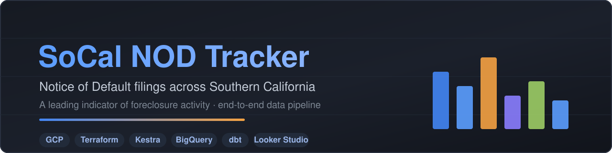
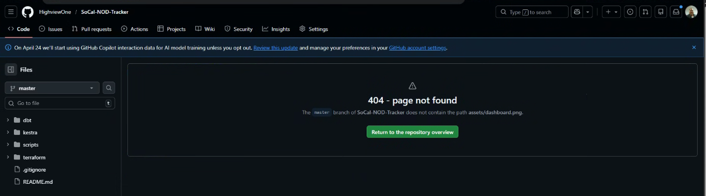

<div align="center">



<br/>

An end-to-end data pipeline tracking **Notice of Default (NOD)** filings across Southern California — a leading indicator of foreclosure activity.

<br/>

[](https://cloud.google.com)
[](https://www.terraform.io)
[](https://cloud.google.com/bigquery)
[](https://www.getdbt.com)
[](https://lookerstudio.google.com)
[](https://www.python.org)


</div>

## Problem Description

A **Notice of Default** is the first formal step in the foreclosure process. When a homeowner falls behind on their mortgage, the lender files an NOD with the county recorder's office — publicly documenting the delinquency and starting the clock on a potential foreclosure sale.

This project ingests daily NOD filings from **6 Southern California counties** (Los Angeles, Orange, Riverside, San Bernardino, San Diego, and Ventura), loads them into a cloud data warehouse, transforms the raw data into analytics-ready tables using dbt, and visualizes foreclosure trends in a Looker Studio dashboard.

**Business questions answered:**
- Which cities are seeing the highest foreclosure activity?
- How is NOD volume trending week-over-week across SoCal counties?
- Which lenders are filing the most NODs?
- What is the average loan-to-value (LTV) ratio for properties entering default?

## Dashboard



**Tile 1 — NODs per Week by County** (temporal): Stacked/grouped bar chart showing weekly NOD volume broken out by county, revealing regional foreclosure trends over time.

**Tile 2 — Top Cities by NOD Count** (categorical): Bar chart ranking cities by total NOD filings, highlighting the areas with the most distressed properties.

## Architecture

```
Daily CSV files (retran/)
        │
        ▼
  cron: daily_load.py (9am Mon–Fri)
        │
        ├──► GCS Bucket  ──────────────── Data Lake
        │    gs://aiagentsintensive-nod-lake/nods/
        │
        ├──► BigQuery Raw  ─────────────── nod_raw.nods
        │    partitioned by ingestion date
        │    clustered by county
        │
        └──► dbt transformations
                 │
                 ▼
             BigQuery Marts  ─────────── nod_production
                 ├─ stg_nods                  (view)
                 ├─ mart_nods_by_county_week   (table)
                 ├─ mart_nods_by_city          (table)
                 └─ mart_nods_by_lender        (table)
                          │
                          ▼
                   Looker Studio Dashboard
```

The same flow is also available as a Kestra DAG (`kestra/nod_daily_pipeline.yml`) for teams that prefer a workflow orchestrator over cron.

## Technologies

| Layer | Tool | Purpose |
|-------|------|---------|
| Cloud | Google Cloud Platform (GCP) | All infrastructure |
| Infrastructure as Code | Terraform | Provision GCS + BigQuery |
| Workflow Orchestration | cron (Kestra DAG optional) | Schedule daily ingestion |
| Data Lake | Google Cloud Storage (GCS) | Store raw CSV files |
| Data Warehouse | BigQuery | Store and query structured data |
| Transformations | dbt (dbt-bigquery) | Staging + mart models |
| Dashboard | Looker Studio | Visualization |

## Dataset

Daily NOD filings sourced from **retran.net**, covering 6 Southern California counties:

| Code | County |
|------|--------|
| (blank) | Los Angeles (with zip-based correction — see `stg_nods` notes) |
| OC | Orange |
| RI | Riverside |
| SD | San Diego |
| SR | San Bernardino |
| VE | Ventura |
| XX | Unknown / out-of-coverage (rare; usually records with no situs address) |

Each record includes: property address, APN, owner name, loan amount, LTV ratio, lender/trustee, recording date, scheduled foreclosure sale date, and geo-coordinates (lat/lon).

## Project Structure

```
.
├── terraform/                  # IaC: GCS bucket + BigQuery datasets
│   ├── main.tf
│   ├── variables.tf
│   └── outputs.tf
├── scripts/
│   ├── bootstrap_load.py       # One-time historical backfill
│   └── daily_load.py           # Daily incremental load (run by cron)
├── kestra/
│   └── nod_daily_pipeline.yml  # Optional Kestra workflow definition
└── dbt/
    ├── dbt_project.yml
    └── models/
        ├── staging/
        │   ├── sources.yml
        │   └── stg_nods.sql    # Clean, typed, county-labeled view
        └── marts/
            ├── mart_nods_by_county_week.sql
            ├── mart_nods_by_city.sql
            └── mart_nods_by_lender.sql
```

## Reproducing This Project

### Prerequisites

- GCP project with BigQuery and GCS APIs enabled
- `gcloud` CLI authenticated: `gcloud auth application-default login`
- Python 3.10+ with dependencies:
  ```bash
  pip install google-cloud-storage google-cloud-bigquery dbt-bigquery
  ```
- Terraform ([install guide](https://developer.hashicorp.com/terraform/install))

### Step 1 — Clone and configure

```bash
git clone https://github.com/HighviewOne/SoCal-NOD-Tracker.git
cd SoCal-NOD-Tracker
```

Edit `terraform/variables.tf` and `scripts/bootstrap_load.py` to set your GCP project ID and bucket name.

### Step 2 — Provision infrastructure

```bash
cd terraform
terraform init
terraform apply
```

Creates:
- GCS bucket: `<project_id>-nod-lake`
- BigQuery dataset: `nod_raw`
- BigQuery dataset: `nod_production`

### Step 3 — Bootstrap historical data

Place your `RETRAN_NODs_YYYY-MM-DD.csv` files in a local directory, then:

```bash
python3 scripts/bootstrap_load.py
```

Uploads all CSVs to GCS and loads them into `nod_raw.nods` (partitioned + clustered).

### Step 4 — Run dbt transformations

```bash
cd dbt
dbt run
```

Creates:
- `nod_production.stg_nods` — staging view (cleaned, typed, county labels)
- `nod_production.mart_nods_by_county_week` — weekly NOD counts by county (partitioned by month, clustered by county)
- `nod_production.mart_nods_by_city` — NOD aggregates by city (clustered by county)
- `nod_production.mart_nods_by_lender` — NOD aggregates by lender (clustered by county)

### Step 5 — Daily ingestion

`scripts/daily_load.py` uploads one day's CSV to GCS, appends it to `nod_raw.nods`, and runs dbt. It can be invoked manually for any date:

```bash
python3 scripts/daily_load.py 2026-03-28
```

**Option A — cron (used in production):** schedule the script for 9am Mon–Fri. Note the `PATH` prefix so cron can find `dbt` (typically installed in `~/.local/bin`):

```cron
0 9 * * 1-5 PATH=$HOME/.local/bin:/usr/local/bin:/usr/bin:/bin python3 /path/to/SoCal-NOD-Tracker/scripts/daily_load.py >> /path/to/logs/nod_daily_load.log 2>&1
```

**Option B — Kestra DAG:**
Import `kestra/nod_daily_pipeline.yml` into your Kestra instance. The flow runs automatically at 9am Mon–Fri and can also be triggered manually with a date input.

### Step 6 — Dashboard

1. Open [Looker Studio](https://lookerstudio.google.com)
2. Add data source → BigQuery → `nod_production.mart_nods_by_county_week`
3. Create a bar/line chart: X = `week_start`, metric = `nod_count`, breakdown = `county_name`
4. Add a second data source → `nod_production.mart_nods_by_city`
5. Create a bar chart: X = `property_city`, metric = `nod_count`

## dbt Model Details

### `stg_nods` (view)
Cleans and casts the raw table: parses dates in MM/DD/YY and MM/DD/YYYY formats, maps county codes to full names (XX → Unknown), normalizes city names to title case so aggregates don't split on casing, casts numeric fields, and selects only meaningful columns.

A blank county code means Los Angeles by feed convention, but roughly 15% of blank-code rows carry zips in neighboring counties (e.g. San Diego 919xx–921xx, Coachella Valley 922xx). The staging model reassigns those by zip — broad prefix ranges for unambiguous blocks, plus explicit zip5 lists for county enclaves inside otherwise-LA prefixes (Orange pockets in 906xx/907xx, Thousand Oaks/Newbury Park in 913xx, Chino/Ontario/Rancho Cucamonga in 917xx). Rows with no zip and no code default to Los Angeles.

### `mart_nods_by_county_week`
Aggregates NOD count, avg loan amount, avg LTV, and avg min bid per week per county. Partitioned by month on `week_start`, clustered by `county_name` for efficient time-range + county filter queries.

### `mart_nods_by_city`
Aggregates NOD count and financial metrics by city. Clustered by `county_name`.

### `mart_nods_by_lender`
Aggregates NOD count, total loan exposure, and avg LTV by lender. Clustered by `county_name`.

## Contributing

Issues and pull requests are welcome. Please use the provided [issue templates](.github/ISSUE_TEMPLATE) and fill out the [pull request template](.github/PULL_REQUEST_TEMPLATE.md) so changes are easy to review.

## License

Released under the [MIT License](LICENSE).
